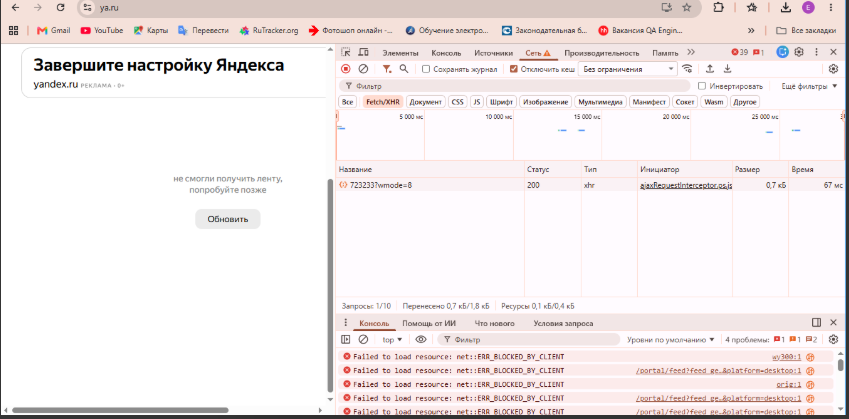

# Отчет по тестированию ya.ru 🧪

## Задание 1. Тест-кейсы: Поиск на ya.ru

**Общие предусловия:** 
* Браузер запущен, открыта главная страница `ya.ru`.
* Стабильное интернет-соединение.
* Очищен кэш браузера.

| ID | Название | Шаги | Ожидаемый результат |
| :--- | :--- | :--- | :--- |
| **TC-01** | Поиск через Enter | 1. Кликнуть в строку поиска. 2. Ввести «коты». 3. Нажать Enter. | Переход на страницу выдачи результатов. |
| **TC-02** | Поиск через кнопку | 1. Кликнуть в строку поиска. 2. Ввести «коты». 3. Нажать кнопку «Найти». | Переход на страницу выдачи результатов. |
| **TC-03** | Поиск через саджест | 1. Кликнуть в строку поиска. 2. Ввести «коты». 3. Выбрать первый вариант из списка. | Переход на страницу выдачи результатов по выбранному запросу. |
| **TC-04** | Пустой запрос | 1. Кликнуть в строку поиска. 2. Нажать Enter без ввода текста. | Страница не перезагружается, поиск не инициируется. |
| **TC-05** | Длинный запрос | 1. Ввести запрос > 250 символов. 2. Нажать Enter. | Система корректно обрабатывает запрос, выдача отображается. |
| **TC-06** | Регистр запроса | 1. Ввести «КОТЫ». 2. Нажать Enter. | Результаты выдачи идентичны запросу в нижнем регистре. |

---

## Задание 2. Исследовательское тестирование

### Анализ выявленных дефектов

#### 1. Критическая ошибка: Блокировка загрузки ленты
* **Статус:** `Critical` (Блокирующий баг).
* **Описание:** Лента контента на главной странице не загружается, отображается ошибка "не смогли получить ленту".
* **Шаги для воспроизведения:**
    1. Открыть `ya.ru`.
    2. Прокрутить страницу вниз до раздела с лентой.
* **Результат:** Лента пуста, в консоли фиксируются ошибки `net::ERR_BLOCKED_BY_CLIENT`.
* **Влияние:** Основная функциональность главной страницы недоступна пользователю.
* **Скриншот:**

#### 2. Баг удобства использования (UX): Потеря фокуса в строке поиска
* **Статус:** `Confirmed` (Подтверждено).
* **Описание:** После возврата на главную страницу со страницы результатов поиска, строка поиска теряет фокус ввода.
* **Влияние:** Пользователь вынужден совершать лишний клик мышью для повторного взаимодействия с поиском.

### Прочие наблюдения
* **Гео-виджет (Погода):** Работает корректно, данные обновляются при смене города через настройки региона. Логика привязки геопозиции реализована верно.

---
*Статус проекта: Исследовательское тестирование завершено.*
